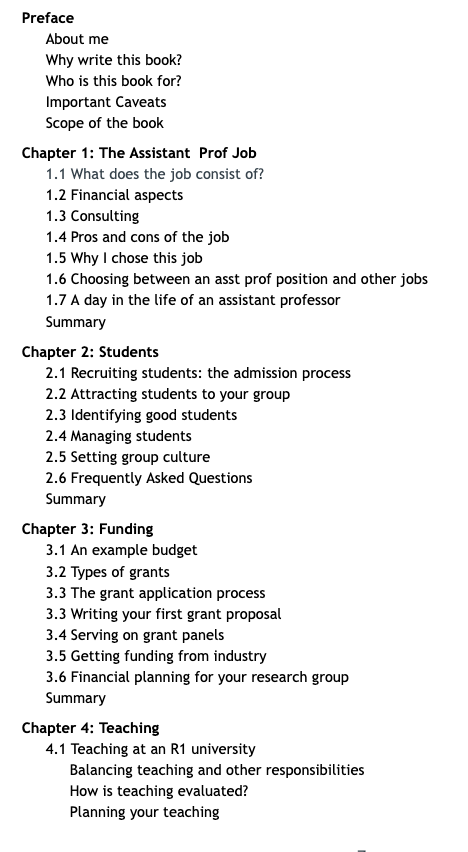
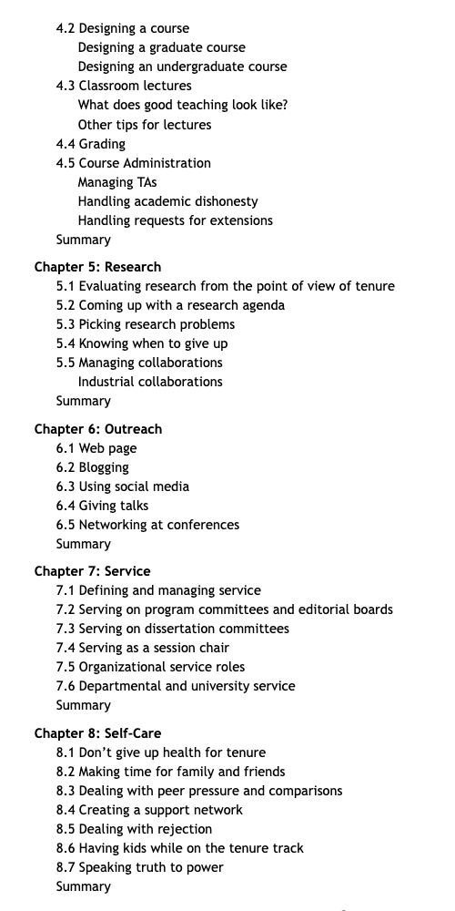
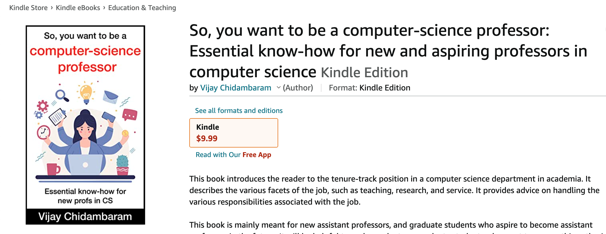

Hello! My name is Vijay Chidambaram, and I'm a recently-promoted Associate Professor at the Department of Computer Science at the University of Texas at Austin. 

I'm the author of the "The CS Assistant Professor Handbook", a book that explains the professor job and discusses the challenges that new professors face. 

If you are interested in the book, please sign up [here](https://forms.gle/VsHjhUBUTAR9a6nJ8) to receive updates, and leave comments! You can use the form to tell me if there are topics you would like me to cover.

 

## Why write this book?

First, I wanted to document my own journey of becoming a professor and getting tenure. I was inspired by [similar posts](https://arunis100.medium.com/the-secret-lives-of-millennial-cs-assistant-professors-part-1-41dc712375ca) from [Arun Kumar](https://cseweb.ucsd.edu/~arunkk/) at UC San Diego. Second, I feel like this knowledge (of how to do the job as an assistant professor in computer science) is handed down from professor to their students, but is not organized and documented in one place. Third, this is advice I anticipate giving my own students and postdocs down the years. So following [Matt Might's advice](https://matt.might.net/articles/how-to-blog-as-an-academic/), I'm writing it all down. 

## Who is this book for?

This book is mainly meant for new assistant professors, and graduate students who are going to start as assistant professors in the near future. That being said, I think it will be helpful to undergraduate or graduate students who want to pursue this path, since it shows them what the job is like. 

## Outline (as of Mar 2023)

## How can I access this content? 

Being a student of [Remzi](http://www.cs.wisc.edu/~remzi) and [Andrea Arpaci-Dusseau](http://www.cs.wisc.edu/~dusseau), how could I not make this [a free online book](http://from-a-to-remzi.blogspot.com/2014/01/the-case-for-free-online-books-fobs.html)? The book chapters will always be available online at this website.

If you want a version that is easier to read on a tablet/kindle, the book is available through Amazon! You can order it [here](https://www.amazon.com/dp/B0BPLYLKQK). It is also available in a number of other countries/regions, such as [India](https://www.amazon.in/dp/B0BPLYLKQK), [Europe](https://www.amazon.de/dp/B0BPLYLKQK), [Canada](https://www.amazon.ca/dp/B0BPLYLKQK), and [Japan](https://www.amazon.co.jp/dp/B0BPLYLKQK).

I'm still exploring making it available from other vendors (it is not exclusive to Amazon).

## Reporting errors 

If you see an error in the book, please open an issue [here](https://github.com/vijay03/asstprofbook/issues). Note that the actual text of the book isn't on Github, so you cannot submit pull requests. I would be happy to fix errors in response to issues. 

## Copyright 

Copyright (c) 2022. Vijay Chidambaram. 

These materials are copyright protected. You must ask me permission to use these materials.

I do not grant to you the right to publish these materials for profit in any form. Any unauthorized copying of the  materials is a violation of federal law and may result in legal action.
