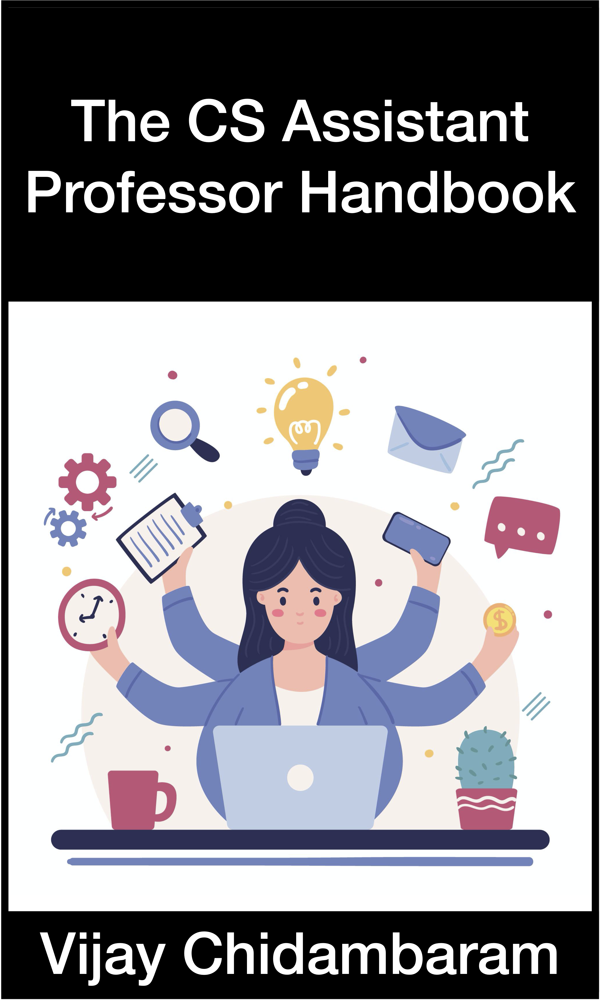
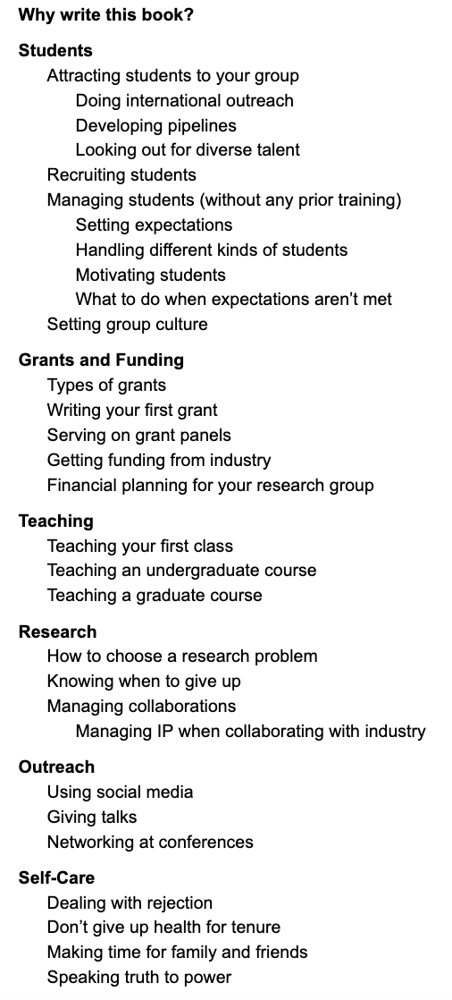

Hello! My name is Vijay Chidambaram, and I'm an Assistant Professor (Associate Professor from Fall 22) at the Department of Computer Science at the University of Texas at Austin. I'm planning to write "The CS Assistant Professor" Handbook over the next year or so (Jun 22 to Jun 23).

If you are interested in the book, please sign up [here](https://forms.gle/VsHjhUBUTAR9a6nJ8) to receive updates!

## Why write this book?

## Outline (as of Jun 2022)

